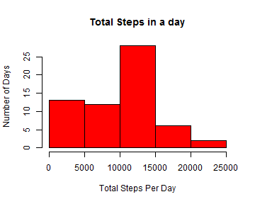
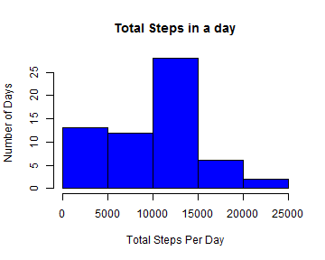
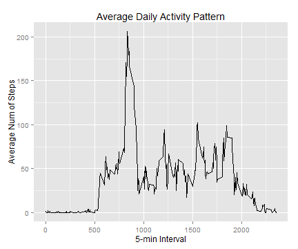
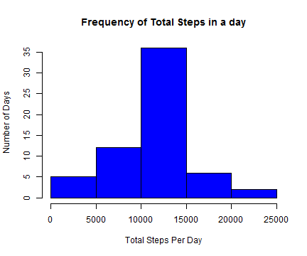
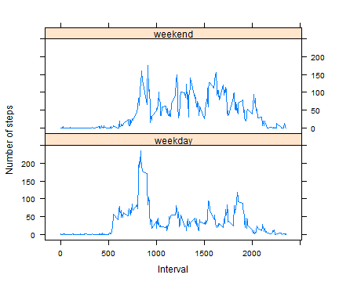

Reproducible Research Programming Assignment 1
==============================================

**Loading and preprocessing the data.**

Here's the code that loads data from *zip* file and convert the format of date from *factor* to *Date* format.

```r
# Read activity.csv file into "activity" variable
unzip("./activity.zip", files = "activity.csv")
activity <- read.csv("activity.csv")

str(activity)
```

```
## 'data.frame':	17568 obs. of  3 variables:
##  $ steps   : int  NA NA NA NA NA NA NA NA NA NA ...
##  $ date    : Factor w/ 61 levels "2012-10-01","2012-10-02",..: 1 1 1 1 1 1 1 1 1 1 ...
##  $ interval: int  0 5 10 15 20 25 30 35 40 45 ...
```

```r
# Convert date variable from factor to date
activity$date <- as.Date(activity$date, "%Y-%m-%d")

str(activity)
```

```
## 'data.frame':	17568 obs. of  3 variables:
##  $ steps   : int  NA NA NA NA NA NA NA NA NA NA ...
##  $ date    : Date, format: "2012-10-01" "2012-10-01" ...
##  $ interval: int  0 5 10 15 20 25 30 35 40 45 ...
```

**Mean total number of steps taken per day.**

Here's the first approach to calculate the total number of steps taken per day and making the histogram with *dplyr* package.

```r
library(dplyr)
```

```r
# Making data frame with dplyr
temp <- activity %>% 
        group_by(date) %>% 
        summarize(totalsteps = sum(steps, na.rm = TRUE))
```

```r
# Plot the histogram
hist(temp$totalsteps, xlab = "Total Steps Per Day", ylab = "Number of Days", main = "Total Steps in a day", col = "red")
```

 

Another approach is by using *tapply* function.

```r
# Making data frame with tapply
temp1 <- tapply(activity$steps, activity$date, sum, na.rm = TRUE);
temp1 <- cbind.data.frame(date = names(temp1),totalsteps = unname(temp1))
```


```r
# Plot the histogram
hist(temp1$totalsteps, xlab = "Total Steps Per Day", ylab = "Number of Days", main = "Total Steps in a day", col = "blue")
```

 

Finally, he mean and median calculation.

```r
mean(temp$totalsteps) 
```

```
## [1] 9354.23
```

```r
median(temp$totalsteps)
```

```
## [1] 10395
```

**The average daily activity pattern.**

Here's the code chuck that makes data frame with the frequency of steps across all days, again with *dplyr* package. Not surprisingly, one could do the same woth *tapply* or *aggregate* functions.

```r
temp2 <- activity %>% 
        group_by(interval) %>% 
        summarize(avgsteps = mean(steps, na.rm = TRUE))
```

Now, let's plot with *ggplot2* package.

```r
library(ggplot2)
```


```r
g <- ggplot(temp2, aes(interval, avgsteps))
g <- g + geom_line() + xlab("5-min Interval") + ylab("Average Num of Steps") + ggtitle("Average Daily Activity Pattern")
print(g)
```

 
Finding the 5-min interval with the maximum number of steps.

```r
temp2$interval[which.max(temp2$avgsteps)]
```

```
## [1] 835
```

**Imputing missing values.**

Calculate and report the total number of missing values in the dataset (i.e. the total number of rows with NAs)

```r
sum(is.na(activity))
```

```
## [1] 2304
```

let's create a vector that will contain the mean for that 5-minute interval where the steps is *NA*.

```r
# Create data frame with mean of steps by interval with aggregate function
temp3 <- aggregate(steps ~ interval, data = activity, FUN = mean)
# Create vector of steps with values for all days 
x <- numeric()
for (i in 1:nrow(activity)) {
        obs <- activity[i, ]
        if (is.na(obs$steps)) {
                steps <- subset(temp3, interval == obs$interval)$steps
        } else {
                steps <- obs$steps
        }
        x <- c(x, steps)
}

# Create new data frame and fill the NAs
activityfull <- activity
activityfull$steps <- x

# Check new data frame for NAs
sum(is.na(activityfull))
```

```
## [1] 0
```

A histogram of the total number of steps taken each day for *activefull* data.

```r
temp3 <- tapply(activityfull$steps, activityfull$date, sum, na.rm = TRUE)
temp3 <- cbind.data.frame(date = names(temp3),totalsteps = unname(temp3))

hist(temp3[,2], xlab = "Total Steps Per Day", ylab = "Number of Days", main = "Frequency of Total Steps in a day", col = "blue")
```

 

The *mean* and *median* for *activityfull* data.

```r
mean(temp3$totalsteps)
```

```
## [1] 10766.19
```

```r
median(temp3$totalsteps)
```

```
## [1] 10766.19
```

**Differences in activity patterns between weekdays and weekends**

Create a factor variable that states whether each day is a weekday or weekend. But at first one need to be sure, that Rsrudio has the right language settings. For instatnce, I'm from Russia and if I want to name the weekaday as Sunday, Monday, etc. I have to change location settings by following code:

```
## [1] "English_United States.1252"
```
Now, let's make new variable (factor) that will indicate if it's a weekday or weekend:

```r
activity$weekdays <- factor(format(activity$date, "%A"))
# levels(activity$weekdays)
levels(activity$weekdays) <- list(weekday = c("Monday", "Tuesday",
                                             "Wednesday", 
                                             "Thursday", "Friday"),
                                 weekend = c("Saturday", "Sunday"))
# levels(activity$weekdays)
table(activity$weekdays)
```

```
## 
## weekday weekend 
##   12960    4608
```

Make a panel plot containing a time series plot (i.e. type = "l") of the 5-minute interval (x-axis) and the average number of steps taken, averaged across all weekday days or weekend days (y-axis). 

At first, let's make data frame.

```r
temp4 <- activity %>%
        group_by(weekdays, interval) %>%
        summarize(avgsteps = mean(steps, na.rm = TRUE))
```

Let's plot the result with *lattice* system.

```r
library(lattice)
```

```r
xyplot(temp4$avgsteps ~ temp4$interval | temp4$weekdays, 
       layout = c(1, 2), type = "l", 
       xlab = "Interval", ylab = "Number of steps")
```

 
